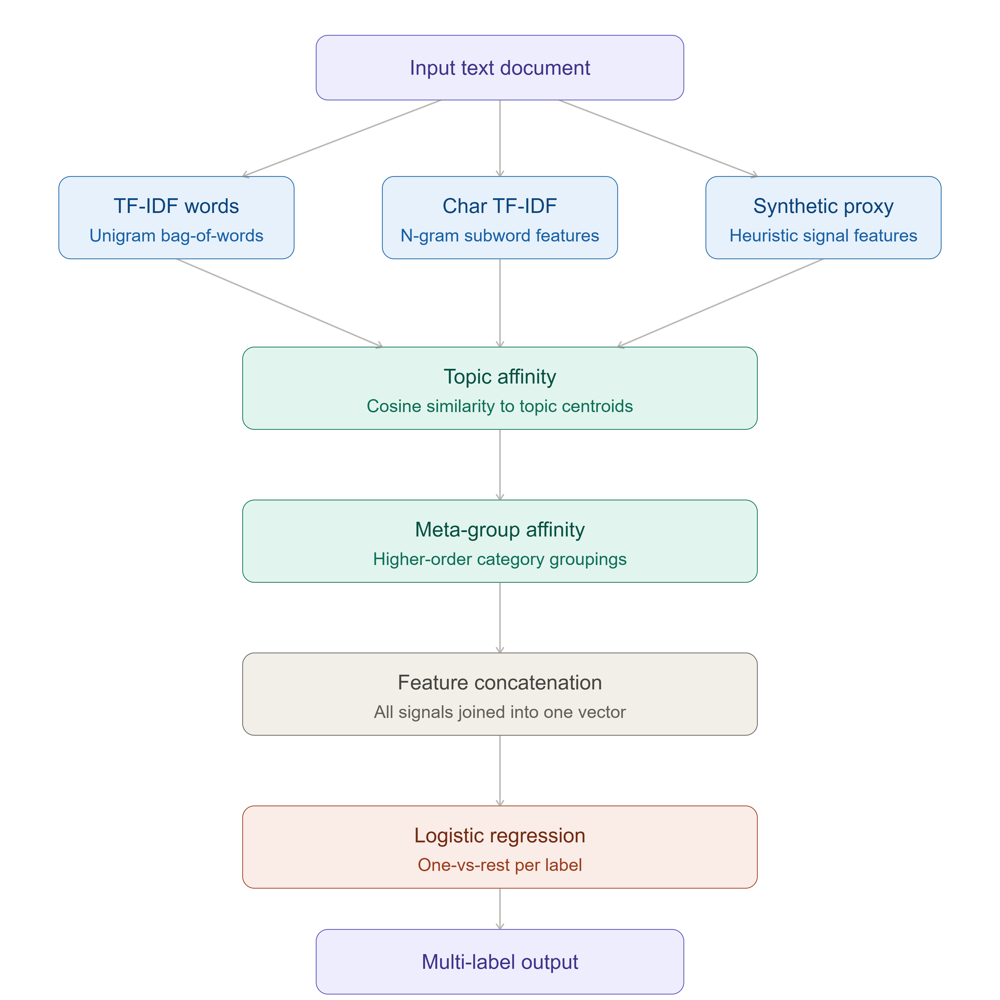

<div align="center">

# 📘 Syntactic Features for Downstream NLP Tasks

### 🚀 Lightweight &nbsp;•&nbsp; Interpretable &nbsp;•&nbsp; Efficient NLP

</div>

---

## 🚀 Overview

This project presents a **lightweight and interpretable** approach to text classification using **syntactic and linguistic feature engineering** instead of computationally expensive deep learning models.

Modern NLP systems:

- ❌ Require high computational resources
- ❌ Depend on GPUs
- ❌ Are difficult to interpret

> 👉 **Goal:** Achieve strong performance without relying on deep learning.

---

## 🎯 Objectives

- ✅ Build a multi-label text classification system
- ✅ Use syntactic & linguistic proxy features
- ✅ Avoid heavy NLP pipelines
- ✅ Ensure interpretability and efficiency

---

## 🧠 Core Idea

<table>
<tr>
<th>❌ Traditional Approach</th>
<th>✅ Proposed Approach</th>
</tr>
<tr>
<td>POS Tagging</td>
<td>Character-level patterns</td>
</tr>
<tr>
<td>Named Entity Recognition (NER)</td>
<td>Statistical linguistic features</td>
</tr>
<tr>
<td>Dependency Parsing</td>
<td>TF-IDF representations</td>
</tr>
<tr>
<td>Deep Embeddings</td>
<td>—</td>
</tr>
</table>

> 👉 **Result:** No external NLP dependencies &nbsp;•&nbsp; Fast and scalable &nbsp;•&nbsp; Fully interpretable

---

## 🏗️ Architecture

<div align="center">
  
</div>

---

## 🔍 Pipeline

```
Input Text Document
        ↓
TF-IDF (word features)
        ↓
Character TF-IDF (syntax proxy)
        ↓
Synthetic Linguistic Features
        ↓
Topic Affinity (centroid similarity)
        ↓
Meta-Group Affinity
        ↓
Feature Concatenation
        ↓
Logistic Regression (One-vs-Rest)
        ↓
Multi-Label Output
```

---

## 🔬 Methodology

- 🔧 **Feature Engineering** (core focus)
- 🔗 Feature fusion
- 🏷️ Multi-label classification
- 🧪 Ablation study for evaluation
- 🚫 No deep learning models used

---

## 📊 Results

### Performance Comparison

| Metric | Baseline | Final Model | Change |
|--------|:--------:|:-----------:|:------:|
| Micro F1 | 0.7352 | **0.8347** | ▲ +13.5% |
| Macro F1 | 0.1193 | **0.5246** | ▲ +4× |
| Hamming Loss | 0.0041 | **0.0028** | ▼ −31% |

### 🔥 Key Highlights

- 📈 **+13.5%** improvement in Micro F1
- 🚀 **4×** improvement in Macro F1
- 📉 **31%** reduction in Hamming Loss
- 🎯 Strong performance on rare labels

---

## 💡 Key Contributions

| | Contribution |
|---|---|
| ⚡ | Lightweight alternative to deep learning |
| 🧠 | Synthetic linguistic proxy features |
| 🔤 | Character-level syntax modeling |
| 🎯 | Topic affinity — major performance boost |
| 🔍 | Fully interpretable pipeline |

---

## 🔍 Key Insights

- Feature fusion significantly improves results
- Topic affinity is the **most impactful** component
- Character TF-IDF effectively captures syntax
- Balanced performance across rare and frequent labels

---

## ⚙️ Installation

**Requirements:**
- `lxml==6.0.2`
- `python-docx==1.2.0`
- `typing_extensions==4.15.0`
- `pandas`
- `scikit-learn`
- `numpy`
- `scipy`

**Setup:**
Clone the repository and install the dependencies:
```bash
pip install -r requirements.txt

---

##  Usage

```bash
python Linguasynth_reuters.py

```

---

## 📦 Tech Stack

| Tool | Purpose |
|------|---------|
| Python | Core language |
| Scikit-learn | ML framework |
| TF-IDF Vectorizer | Feature extraction |
| Logistic Regression | Classifier |

---

## ⚠️ Limitations

- Synthetic features approximate real linguistic structures
- Limited deep semantic understanding
- Slightly lower performance than transformers on complex tasks
- Depends on dataset quality

---

## 🔮 Future Work

- 🔀 Hybrid models (Feature Engineering + Deep Learning)
- 🤗 Integration with contextual embeddings (BERT)
- 🛠️ Improved linguistic feature design
- 🌍 Extension to real-world applications

---

## 🏁 Conclusion

> **Better feature engineering can compete with deep learning.**

<div align="center">

| ✔ No GPU required | ✔ Fast and scalable | ✔ Fully interpretable | ✔ Strong performance |
|:-----------------:|:-------------------:|:---------------------:|:--------------------:|

</div>

---

